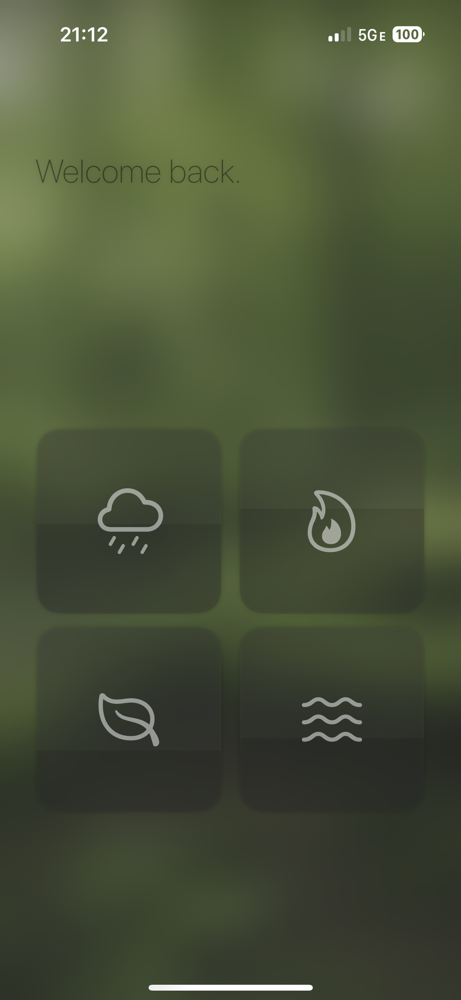

# Noise

## Overview  
Noise is a personalized soundscape creator built using SwiftUI and other native iOS frameworks. This app allows users to relax, focus, or enhance their environment through a diverse library of natural sounds. Each sound can be customized with adjustable intensity, while dynamic abstract visuals complement the auditory experience, creating a harmonious blend of sound and art.

---

## Features  

### Personalized Soundscapes  
- Sound Library: Choose from a variety of natural sounds, including:
  - Rain  
  - Ocean Waves  
  - Campfire  
  - And more!  
- Dynamic Volume Controls: Adjust the intensity of individual sound sources using an intuitive slider interface to craft your ideal mix.

### Dynamic Abstract Visuals  
- Visual Generation: Unique abstract art corresponds to the sounds you select.  
- Reactive Colors: Visual colors and patterns shift based on the active soundscape.  
- Intensity Mapping: The visuals become more vivid or subdued depending on the volume settings, enhancing the immersive experience.

---

## Technology Stack  

- SwiftUI: For a smooth, declarative UI experience.  
- AVFoundation: Powers seamless sound playback and mixing.  
- CoreGraphics & CoreAnimation: Enables real-time generation of abstract visuals synchronized with sound intensity.  
- Combine: Handles dynamic bindings between user input and app behavior.  

---

## How It Works  

1. Select Your Sounds  
   - Tap to choose from the library of natural sounds.  
   - Mix and match multiple sound sources for a layered soundscape.  

2. Adjust Sound Intensity  
   - Use volume sliders to customize each sound source's level.  

3. Experience Dynamic Art  
   - Watch abstract visuals evolve as you interact with the app.  
   - Enjoy a synchronized audio-visual journey tailored to your preferences.

---
